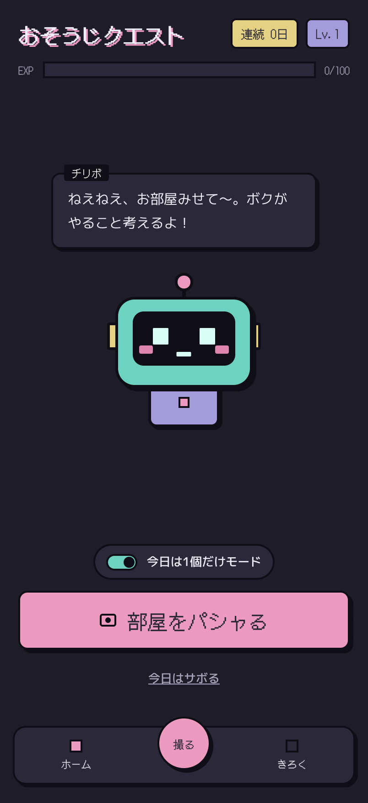
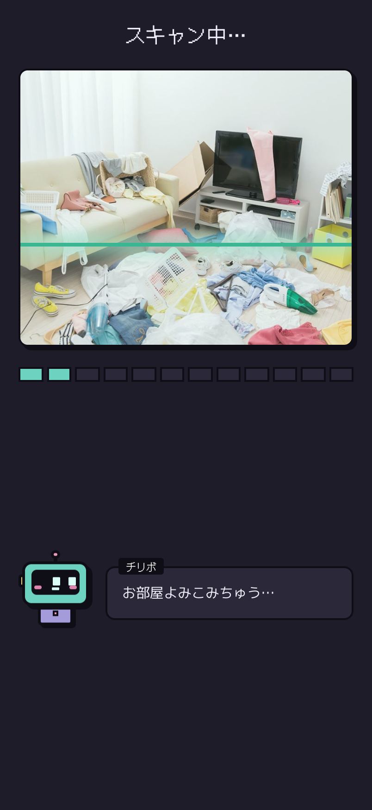
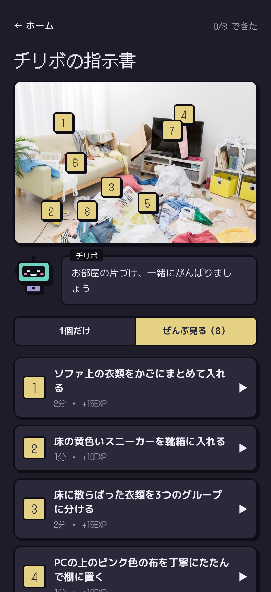
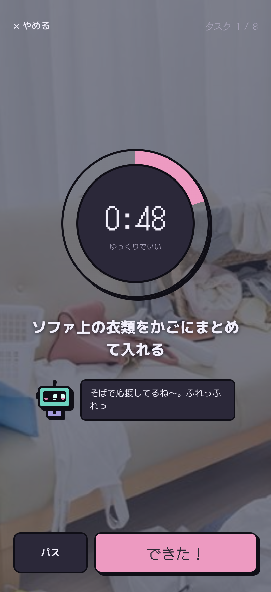
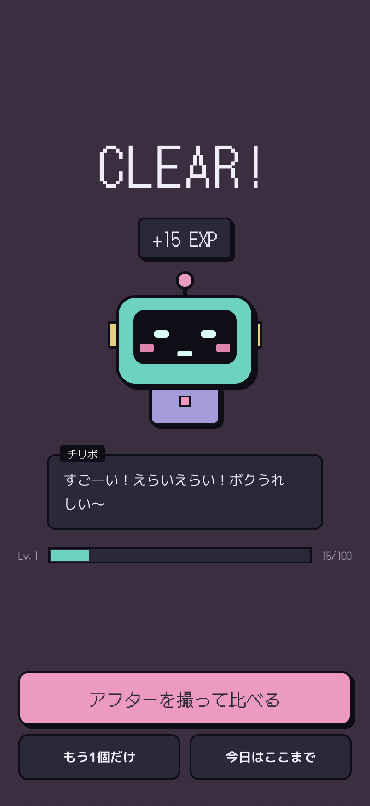

# おそうじクエスト

部屋を撮ると、片づけロボ「チリボ」が1分で終わる片づけミッションを出してくれるPWAです。
片づけが苦手な人が「全部やらなきゃ」と思わずに、1個だけ手をつけられることを目指しています。

**デモ:** https://osoujiquest.pages.dev/ （スマホで開いて「ホーム画面に追加」するとアプリとして使えます）

<p>
  
  
  
  
  
</p>

## できること

- **部屋をパシャる** — 撮った写真を Claude が見て、「ペットボトルを3本すてる」のような1〜2分のミッションを最大10個出す。写真の上に番号ピンで場所を示す
- **1分タイマー** — ミッションごとに60秒のリング。時間切れでも止めない（「時間切れでもいいよ」）
- **EXP・レベル・連続記録** — 1分ミッションで10EXP、2分で15EXP。100EXPでレベルアップ。「今日はサボる」やおやすみの曜日でも連続記録はとぎれない
- **ビフォー/アフター** — 片づけ後の写真をスライダーでくらべる
- **チリボのしんだん** — ビフォーとアフターを見くらべて、変わった場所をほめ、次の1分アドバイスを出す。点数はつけない（ほめるだけ）。アドバイスはそのまま次のミッションに追加できる
- **きろく** — 5週間のカレンダーとセッション一覧。JSONで書き出しできる

## しくみ

- **データは端末だけ** — プロフィール・設定・セッション・写真は IndexedDB（Dexie）に保存。サーバーには何も残さない。写真は7日/30日/ずっとから選んで自動で消せる
- **サーバーはAPIキーを隠すためだけ** — Cloudflare Pages Functions が Claude API（`claude-haiku-4-5`）への中継だけをする。ツール呼び出しを強制して、返事のJSONの形を固定している
- **ゲームのルールは端末で決める** — AIの返事は端末で検証し直し（件数・文字数・座標）、EXPはAIに決めさせない。しんだんのピンの位置も、写真を3×3に分けた輪郭の量の比較で端末が決め、AIは文章だけを書く
- **AIが使えなくても動く** — オフラインやAPIエラーのときは、決まった予備ミッションや端末で作った文章に切り替える
- **写真の扱い** — 送る前に長辺1024pxのJPEGに描き直すので、位置情報（EXIF）も消える。アフター写真はしんだんを開いたときだけ送る

## 技術スタック

TypeScript / React 18 / Vite / vite-plugin-pwa（Workbox） / Dexie（IndexedDB） / プレーンCSS（CSS変数で配色を管理） / Cloudflare Pages + Pages Functions / Anthropic Claude API

## ローカルで動かす

```sh
npm install
cp .dev.vars.example .dev.vars   # ANTHROPIC_API_KEY を書く（なくても予備ミッションで動く）

npm run dev       # 画面（http://localhost:5173）。/api/* は 8788 に中継される
npm run dev:api   # API（wrangler pages dev、ポート 8788）
```

| コマンド | 内容 |
| --- | --- |
| `npm run build` | 型チェック（src・shared・functions）と本番ビルド。出力は `dist` |
| `npm run lint` | oxlint |

Service Worker は `npm run build` でだけ作られます。PWAの動きを試すときは、ビルドしてから `npm run dev:api` のポート 8788 を開いてください。

## デプロイ

Cloudflare Pages の Git 連携で、`main` に push すると自動でデプロイされます（ビルドコマンド `npm run build`、出力 `dist`）。
`ANTHROPIC_API_KEY` は Pages プロジェクトの Settings → Variables and Secrets に **Secret** として登録します。登録後は再デプロイが必要です。

## ディレクトリ

```
functions/api/analyze.ts   # 写真 → ミッション（Claude への中継）
functions/api/review.ts    # ビフォー/アフター → しんだん（Claude への中継）
shared/types.ts            # フロントと関数で共有する型
src/App.tsx                # 画面の切り替えと保存の流れ（ルーターなし）
src/screens/               # 各画面
src/components/Chiribo.tsx # チリボ（CSSだけで描いたマスコット）
src/lib/                   # DB・ゲームルール・画像・AI呼び出し・しんだん・セリフ
```

設計の詳細は `おそうじクエスト 最小構成 設計書（個人検証用）.md` にあります。
